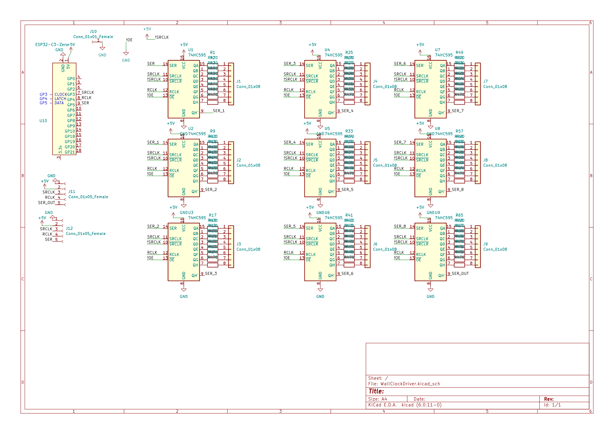
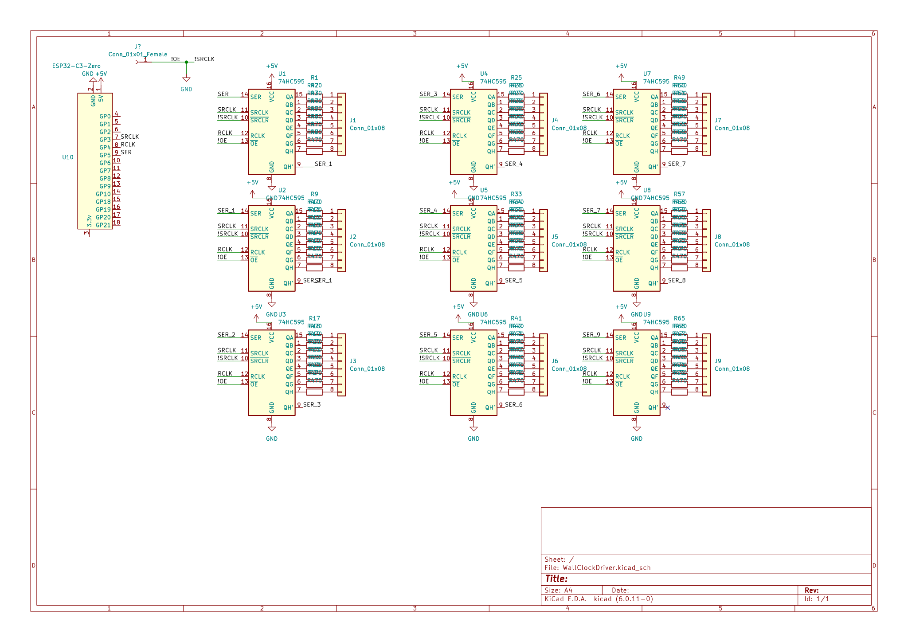

## Update Jun
- had some stuff wired wrong, fixed and in the new version

## Inital

Im making a clock, and this is the shift register board that has atleast 72 outputs

there will be code somewhere at some point. Likely in this repo

The MCU is an ESP32-C3-Zero, for the wifi to sync date and time.